# Fundamentals I

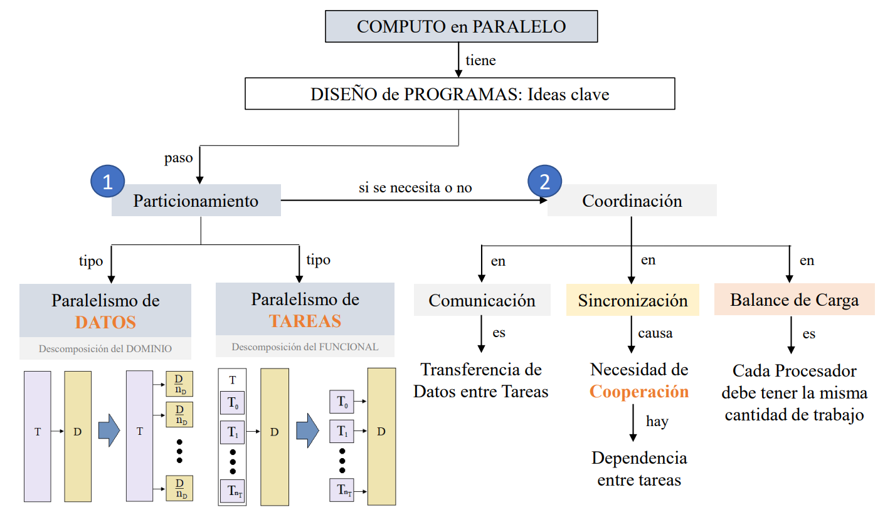

When designing a program that will use parallelism, there are a few key concepts that allow this design. The *first key idea* used for parallelism construction is **partitioning**. Partitioning is basically dividing the problem in small **Tasks (T)**, but there are two types of partitioning:

1. **The Parallelism of Data**, also known as *Domain Decomposition*, which allows us to divide or patition the problem **based on data**. By looking at the image below, there is a Task (T), that represents a whole program, and also a data set (D) over which the Task will work on. What this partitioning type consists in, is dividing the data in pieces with which we can act upon in a **concurrent** way. This can be seen now with the Task (T) referring to each D/n_D, or data parts, where n is the number of partitions. Thus, the purpose is that the Task T is repeated for **each data piece D/n_D until all pieces of data are used**. 

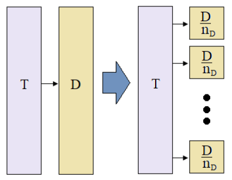

- An example of this would be:

Our data is a series of numbers stored in a matrix A:

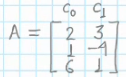

where c_0 is column 0 and c_1 is column 1. Also, we have a Task T that we need to execute upon those numbers; T is to transform matrix A as:

> A = [(2 * c_0) (c_1 + 1)]

which means to do the following operations:

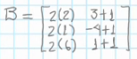

The Task T is basically going to be an algorithm.

Anyway, to do the parallelism of data: the idea is to divide the data in n partitions. With matrix A, the easiest is to divide it into 3 partitions: `p_1 = [2 3], p_2 = [1 -4], p_3 = [6 1]`. Now, we will have **one Task per data partition**, where each of these Tasks is exactly identical but it takes different data. Thus, we have one program that will not be executed over all data elements, but will actually be executed per partition. So, how do we know how to partition the data so that this works?

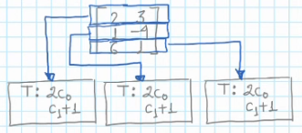

- We need to partition data so that the Task / algorithm can be executed both in a piece of the data set and in its totality. In this case, the data set is partitioned in *lines*, because the Task T expresses the need of c_0 and c_1 information. In this way, each copy of the Task can be executed over all different data pieces (3).

- Given the fact that the Task T can be executed over each data piece, the identical copies of T can be executed **at the same time**.

- The result of Task T is a matrix:

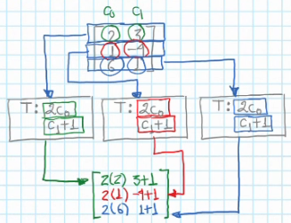

- We win time performance because T is executed three times **at the same time**, and thus the data set values need to be **independent from each other**: a Task T copy must not need the access to the data pieces of other T copy. This is sometimes not possible so there will be **communication** among the processes/threads executing Tasks. 

- Imagine we have a bigger data matrix A, and since we have, say, **4 microprocessors/processors (P) in the CPU, we can have only 4 Task copies, and each Task copy gets 1 of the 4 data partitions**. Thus, the Tasks will need more than one line as input.

    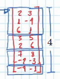

    - Each Task copy is executed by a processor/microprocessor, called P. Thus, the Task is completed by four Task copies that work simultaneously.

    - Suppose that a Task T (2c_0, c_1+1) with one line of data takes 1 unit of abstract time of the processor, say, seconds: 1T = 1s.

        - Then, processor p_1 takes three lines of info, and these are executed **sequentially** or in series, because they are to be executed in the **same processor**, and only multiple processors can run something in parallel. Therefore, the time taken for each processor is:

        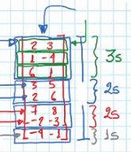

        - How long will it take for the CPU with these 4 processors to execute the whole Task? **The time that it takes for the processor that uses the maximum time of all other processors**.

        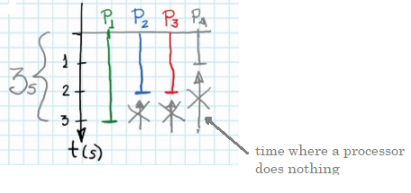

        - In the above image, we can see that with these partition, there are times where processors do nothing and others are working. We can **gain on time performance when we distribute data as equally as possible among the processors**, and thus reduce the amount of time as much as possible. In this case, by partitioning the data equally among the 4 processors, we finish in 2s rather than 3 and we have no waiting time from other processors. This equilibrated partition that is used is what we call **load balance**: load balance is the equilibrium in the work load that each processor has to execute in the CPU. *Not all the time can we equally/simmetrically distribute the work load, but *the idea is to maintain all involved processors working at the same time and during the largest possible time, out of the overall execution time.* This causes the best possible use of processor resources.

        - Each nucleus is a (micro)processor, and these nuclei can be found either on graphics processors (GPUs) or CPUs.

        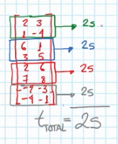

        - *Note: to calculate total execution time like above, do not sum all processor times since they are executed in parallel, instead take the maximum. In the original matrix A example:*

        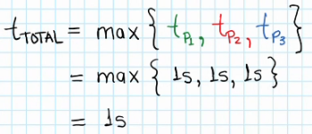

2. **The Parallelism of Tasks**, also known as *Functional Decomposition*, and in this case the focus is on partioning the Task T in a set of n smaller Tasks T_1, ..., T_n. This is basically what we know as "divide and conquer". This partitioning type consists in dividing the Task into smaller tasks that can be executed in parallel. The Task is the whole program, which is an algorithm, or a series of instructions, and after the partitioning, instead of having one algorithm, we have a set of algorithm or tasks that are smaller and to whom the **whole data set** is sent to: each T_n works over all the data set.

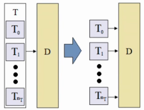

- An example would be:

Our data is a series of numbers stored in the matrix A:

The Task T is: 

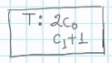

- We can see above that the Task T can be easily partitioned in two smaller tasks: 

    1. (2 * c_0), where c_0 is one number.

    2. (c_1 + 1), where c_1 is one number.

    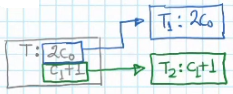

- After determining T_1 adn T_2, we send the **whole matrix of information to each Task**, even though they may not be used all.

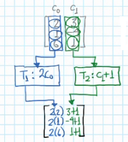

- How to calculate the total execution time? In this program, we have now 2 Tasks, instead of 4, and so we will **execute each Task T_n in each processor**, and we will use 2 processors as a total. If we consider what we said above, the previous Task T consisted in a multiplication and a sum on one line, and this took 1 second, therefore **tasks T_1 and T_2 will take 0.5 seconds** since they only do one operation, half of Task T. 

    - Thus, each processor will do one operation on three numbers (even though we sent it the whole matrix), and since these three operations are *done in a single processor*, they are don **sequentially**. In this way, each processor will do 3 operations that take 0.5s each = 1.5s per processor. 

    - The total execution time is then:

    > t_total = max({t_1, t_2})  
    > t_total = max({1.5, 1.5})  
    > t_total = 1.5s

    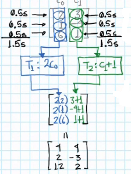

**Out of the two approaches with matrix A example, the faster one is using Data Partition. Other cases may be opposite and need Task Partition**. Sometimes there are problems that can only be divided using one type, or both; when it can be analyzed using both techniques, choose the faster one to implement. Partitioning technique choosing is the first analysis to be done when a parallel problem is being detected. 

The *second key idea* or step is: **ask ourselves if we need Coordination** in our program: coordination among all Tasks that are being executed in parallel. Even though we can use Task Partition to divide into smaller tasks, or Data Partition to divide into data pieces, so that we have *Task copies*, sometimes we need a certain coordination among all Task copies. Why? because there can be **Data Dependency**. When the problem is totally parallelizable, like the example of A matrix, we did not need coordination among tasks. There are 3 reasons for which we can use Coordination among Tasks:

1. **Communication**, which means Data Transference between Tasks. Sometimes a Task needs bits of information from other Task, and that's where Communication happens. This can be due to the Task needing the other's results to go on, etc. This means that the Tasks and Data, the program itself, could **not be totally parallelizable**, and so when we use Communication we introduce Coordination, and thus obliges Tasks to be serialized during a period of time. 

    - The sequential or serial part of my program, no matter how many processors were executing in parallel, that part needs to be executed by **one processor**, that's why it is sequential.

    - **Communication** also always involves **Synchronization**, or pauses when processors wait for others so that the data they need is ready or the communication channel is available. Thus, communication slows down time performance importantly.

2. **Synchronization**, whose origin or cause is the **need of cooperation**, which means when a processor stops to wait for other computation to finish and cooperate. We need this cooperation because there is **Task Dependency**, and this in turn serializes our program as well, because tasks are done sequentially during synchronization: **not totally parallelizable**. 

3. **Load Balance** (Balance de Carga), which means that **all processors involved have the same** or the most similar amount of **work** between each other, because if processors have different amounts of work then there are processors with less work, and this is a resource (time) waste. In this way, the better load balance, the less execution time.  

    - An example of this is the *scheduler* (planner) of an Operating System, which balances the load of the CPU (micro)processors. This allows the Operating System to *virtualize* processors, that is, make the illusion of more processors, one for each application running. This illusion is done by **virtualizing** and it uses the technique of **shared time**, which involves paying attention to each app running for a small period of time, until all apps are attended sequentially and so on.

If the program is designed for, say, 8 processors, and we only have 4 processors, the program will be balanced by the scheduler and we will obtain the performance of only the processors we have.