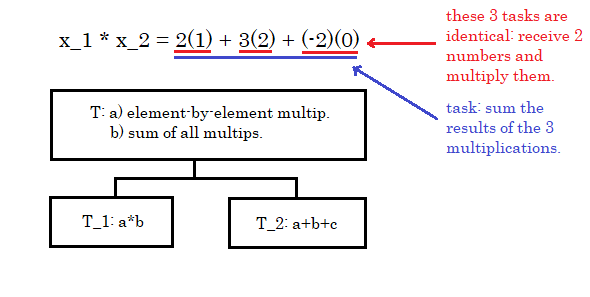
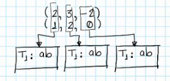
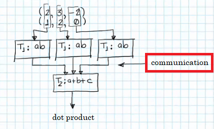

# Fundamentals II

We saw earlier that we needed Coordination sometimes seen in three different forms: Communication, Synchronization or Load Balance. Let's do an example of **Communication**.

- Our problem has the **data**: two vectors.

> x_1 = (2, 3, -2)  
> x_2 = (1, 2, 0)

- And the Task is: dot product of the vectors.

> x_1 * x_2 = 2*1 + 3*2 + -2*0

- Task T involves two operations: the element-by-element multiplication and the sum of all these products. Thus, we can decompose Task T into two smaller tasks.

### Assign Task 1

Then, we create **three T_1 copies**, which will be executed in parallel, that will each multiply a pair of numbers:

### Assign Task 2

Now, we need to assign T_2, but this task cannot operate over the input data (the two vectors x_1 and x_2), because T_2 sums the **results of the three multiplications**. Therefore, T_2 **needs to wait for T_1 copies (T_1)** to finish their multiplication of data, in order to receive the elements as T_2 expected input and execute its task.

Thus, T_2 has to wait for T_1 copies, and therefore has **a dependency on those tasks**. In this part of waiting to receive, is where **communication** intervenes. In last chapter's examples, this dependency did not exist, nor the communication ammong tasks didn't either.

