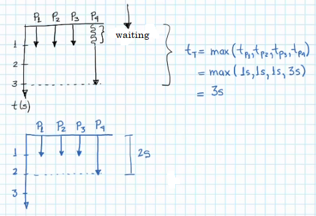

# Fundamentals II

We saw earlier that we needed Coordination sometimes seen in three different forms: Communication, Synchronization or Load Balance. Let's do an example of **Communication**.

## Communication

- Our problem has the **data**: two vectors.

> x_1 = (2, 3, -2)  
> x_2 = (1, 2, 0)

- And the Task is: dot product of the vectors.

> x_1 * x_2 = 2(1) + 3(2) + (-2)(0)

- Task T involves two operations: the element-by-element multiplication and the sum of all these products. Thus, we can decompose Task T into two smaller tasks.

### Assign Task 1

Then, we create **three T_1 copies**, which will be executed in parallel, that will each multiply a pair of numbers:

### Assign Task 2

Now, we need to assign T_2, but this task cannot operate over the input data (the two vectors x_1 and x_2), because T_2 sums the **results of the three multiplications**. Therefore, T_2 **needs to wait for T_1 copies (T_1)** to finish their multiplication of data, in order to receive the elements as T_2 expected input and execute its task.

Thus, T_2 has to wait for T_1 copies, and therefore has **a dependency on those tasks**. In this part of waiting to receive, is where **communication** intervenes. In last chapter's examples, this dependency did not exist, nor the communication ammong tasks didn't either.

Once The Task is executed in parallel, its result is the do product, which is 8.

- If we assign each of the tasks to a processor, and we do a time diagram, to calculate the execution time of the Task (program). If we assume that it takes 1s to perform one operation over one number: T_1 will take 1s, and T_2 will take 2s since it does two sums.

- The fact that the processes (tasks) have to communicate obliges the **tasks to be serialized** (sequential). What does it mean when we say **tasks are serialized**? That one task has to be executed **after another**.

- The effect on the program that the sequential parts have is the **waiting time**. This also provokes a larger execution time.

- If we could run T_2 in parallel as well, our time diagram would look as follows:

- **Serialization** is then when a task needs to be executed after another one.

Communication has to do with the Transference of Data, which in this example we can see where the results of the three T_1 copies are passed to T_2. The data transference thus is made from T_1 to T_2.

## Synchronization

**Synchronization** means that the processes are *organized* so that one is executed after another one. During the **Communication** example, task/process T_2 has to be *organized* so that it executes after tasks T_1 are done. That is also a type of **Synchronization**. Thus **Communication** requires **Synchronization**.

There is another type of Synchronization, which is a type that exists when there is **access to the same data at the same time**. For example,

- Our data is: 

> x = 0

- The Task is: 

> add 2 to x  
> add 3 to x

What is expected is:

> x = 0  
> x = 2  
> x = 5

- To parallelize this, we need to break the Task into smaller tasks that will be executed in **parallel**:

- If the two tasks are executed in parallel, that is, at the same time, the two tasks **will access x value simultaneously** and thus give an incorrect output.

*Note: the incorrect output also depends on which task finishes processing first and thus replaces x value first. Could have output x = 2. Or maybe both finished at the same time and tried to change x simultaneously and thus wrote something weird (third option).*

The problem here lies in that T_2 is not realizing that it must execute after and with the value of T_1 output. This is what we know as **Race Condition** (condición de carrera). This can happen not only between **processors/tasks**, but also between machines, bank accounts, etc. Since there **was not synchronization**, we didn't get the expect result of x = 5.

Then, what do we need to do in order to make these tasks work? the answer is **the first task that accesses the value of x, needs to signal a wait flag for the other task**, and thus the first one says that when it finishes its task, the other task can proceed and execute its own. Thus, the latter task **waits** for the first to finish and then executes. This is **synchronization**. Different scenarios can happen in this case:

- Scenario 1: Suppose that T_1 is the first to access x value, then when T_1 finishes, the control is passed to T_2.

- Scenario 2: Suppose that T_2 is the first to access x value, then when T_2 finishes, the control is passed to T_1.

With its two time diagrams:

- Scenario 3: both T_1 and T_2 are executed in parallel. The time is reduced to 1s.

- The fact that we need this **synchronization** provokes that one task *after* another, that is, it is provoking **serialization**. It is serializing the two tasks.

    - **Synchronization always required Serialization**. Thus, in programs that use parallelism, the idea is to do two things:
    
    1. **Reduce communication** to the minimum possible.

    2. **Reduce synchronization** to the minimum possible.

    So that they can execute the most of the algorithm in parallel.

- The **price** to pay due to **Synchronization** always is **to increment execution time**.

## Load Balance

Load Balance refers to when all processors working in parallel have the same amount of work during the largest amount of time possible. This equilibrium must be **active** when the tasks are working, to that when waiting time finishes or tasks have changed, the distribution of work is also **updated**. The purpose of Load Balance is to **reduce time execution as much as possible**. Let's see an example:

- Data: the vectors:

> x_1 = (2, 1, 3, 4)  
> x_2 = (5, 6, 7, 1)

- Task we want to execute upon such data is: the sum of the two vectors.

> x_1 + x_2 = (2+5, 1+6, 3+7, 4+1) = (7, 7, 10, 5)

In this Task, we only have **one** operation, and so its division is not possible.

Each sum operation (T) in **independent** from one another. Thus, if we have a lot of processors, we can assign one to each of the 4 sums/tasks/operations we have to execute. We assign one Task T copy to each pair of numbers that need to be added. Therefore, each of the tasks will be executed in **parallel** and output:

If we got 4 task copies, then we got 4 processors executing in parallel:

- Imagine now that we only got **2 processors**. We still have to execute 4 tasks, with the same data each, but only in two processors. That means we need to **distribute** the tasks among the processors. That is how p_1 will get the first 2 sums and p_2 will get the other 2 sums.

Each two of the processors will execute their two tasks in **sequence** or in series.

- The more we reduce the amount of processors, the more time the tasks will take to be executed, even though they can be **parallelized**. 

- All operations done in a **single processor** are done **sequentially or in series**.

Thus, **Load Balance** here is done by determining that each processor will do the same amount of work, that is, the four tasks we have are divided by the number of processors we have. When we distribute symmetrically like this, **we are reducing the execution time as much as possible**. Load Balance is crutial since we seldom have the same amount of tasks and processors.If we dont do it and split otherwise:

During "wasted time" the processor was inactive, and also took longer to complete the Task T than the previous distribution.

> So these are the four things to analyze when working in a parallel program: the type of Partition we need; if there is Communication, which will involve Synchronization; if we have another type of Synchronization; and finally, how to perform a Load Balance.

# The Foster Method

When facing the problem of how to perform a Load Balance so that the execution in parallel ends up being as optimal as possible, people came up with **The Foster Method**.

**The Foster Method** is a technique based on 4 steps, that allow us to build parallel programs in the most efficient way, and which has been adopted by almost every book. Basically, what Foster did was to **consider the 4 concepts** we just checked. He conglomerated everything and came up with 4 steps:

1. **Partitioning**, when we do the partitioning, we divide the original problem in smaller tasks, or divide the data in subsets that will be filling a subset of tasks. Break into the **smaller Task size as possible** to use resources the wisest.

    - Use the two types of partitioning for this step.

2. **Communication**, which is checking if there is communication between these small subtasks. If they do, we connect a pair of related tasks with **a line that represents the communication channel of that pair**.

    - The more lines/channels of **communication** my program/problem has,
    
        - the less **parallelization** we have,

        - the more insertion of **serialization** there is among tasks, and

        - the **slowest** the parallel program will be.

3. **Union**, which refers to the union of tasks, which implicitly involves **synchronization**. Since we broke down the problem as small as possible in step 1, and communicated these smallest bits in step 2, so that in step 3 we **link tasks** based on two things:

    1. If there is dependency; if one task is executed after another, **we link those two as one bigger task**, because they oblige **serialization**. This takes us to 2: (If there was a line between a small and big task, it remains.)
    
    2. We link tasks since maybe we do not have as much processors as there are small tasks. And also, if we group based on dependency and we send **a serialized group to a single processor**, we are avoiding serialization **and communication** (slower) if, for example, we send a serialized group to two processors and they need to communicate.

- The less communication, the less serialization, the less execution time.

- Communication channels involve memory, and 1 memory access is 100 times slower than a processor operation. That is why communication increases execution time. In the previous examples, we are not even counting this time to calculate total execution times.

4. **Mapping** or Load Balance. Once we got all of our *bigger* tasks linked, we decide wich one(s) to send to a processor, in such way so that the distribution or **amount of work** in processors is **as symmetrical as possible during as much time as possible**, and **reducing the communication between processors**.

    