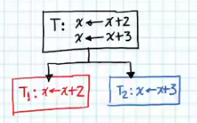

# Fundamentals II

We saw earlier that we needed Coordination sometimes seen in three different forms: Communication, Synchronization or Load Balance. Let's do an example of **Communication**.

## Communication

- Our problem has the **data**: two vectors.

> x_1 = (2, 3, -2)  
> x_2 = (1, 2, 0)

- And the Task is: dot product of the vectors.

> x_1 * x_2 = 2(1) + 3(2) + (-2)(0)

- Task T involves two operations: the element-by-element multiplication and the sum of all these products. Thus, we can decompose Task T into two smaller tasks.

### Assign Task 1

Then, we create **three T_1 copies**, which will be executed in parallel, that will each multiply a pair of numbers:

### Assign Task 2

Now, we need to assign T_2, but this task cannot operate over the input data (the two vectors x_1 and x_2), because T_2 sums the **results of the three multiplications**. Therefore, T_2 **needs to wait for T_1 copies (T_1)** to finish their multiplication of data, in order to receive the elements as T_2 expected input and execute its task.

Thus, T_2 has to wait for T_1 copies, and therefore has **a dependency on those tasks**. In this part of waiting to receive, is where **communication** intervenes. In last chapter's examples, this dependency did not exist, nor the communication ammong tasks didn't either.

Once The Task is executed in parallel, its result is the do product, which is 8.

- If we assign each of the tasks to a processor, and we do a time diagram, to calculate the execution time of the Task (program). If we assume that it takes 1s to perform one operation over one number: T_1 will take 1s, and T_2 will take 2s since it does two sums.

- The fact that the processes (tasks) have to communicate obliges the **tasks to be serialized** (sequential). What does it mean when we way **tasks are serialized**? That one task has to be executed **after another**.

- The effect on the program that the sequential parts have is the **waiting time**. This also provokes a larger execution time.

- If we could run T_2 in parallel as well, our time diagram would look as follows:

- **Serialization** is then when a task needs to be executed after another one.

Communication has to do with the Transference of Data, which in this example we can see where the results of the three T_1 copies are passed to T_2. The data transference thus is made from T_1 to T_2.

## Synchronization

**Synchronization** means that the processes are *organized* so that one is executed after another one. During the **Communication** example, task/process T_2 has to be *organized* so that it executes after tasks T_1 are done. That is also a type of **Synchronization**. Thus **Communication** requires **Synchronization**.

There is another type of Synchronization, which is a type that exists when there is **access to the same data at the same time**. For example,

- Our data is: 

> x = 0

- The Task is: 

> add 2 to x  
> add 3 to x

What is expected is:

> x = 0  
> x = 2  
> x = 5

- To parallelize this, we need to break the Task into smaller tasks that will be executed in **parallel**:

- If the two tasks are executed in parallel, that is, at the same time, the two tasks **will access x value simultaneously** and thus give an incorrect output.

*Note: the incorrect output also depends on which task finishes processing first and thus replaces x value first. Could have output x = 2. Or maybe both finished at the same time and tried to change x simultaneously and thus wrote something weird (third option).*

The problem here lies in that T_2 is not realizing that it must execute after and with the value of T_1 output. This is what we know as **Race Condition** (condición de carrera). This can happen not only between **processors/tasks**, but also between machines, bank accounts, etc. Since there **was not synchronization**, we didn't get the expect result of x = 5.

Then, what do we need to do in order to make these tasks work? the answer is **the first task that accesses the value of x, needs to signal a wait flag for the other task**, and thus the first one says that when it finishes its task, the other task can proceed and execute its own. Thus, the latter task **waits** for the first to finish and then executes. This is **synchronization**. Different scenarios can happen in this case:

- Scenario 1: Suppose that T_1 is the first to access x value, then when T_1 finishes, the control is passed to T_2.

- Scenario 2: Suppose that T_2 is the first to access x value, then when T_2 finishes, the control is passed to T_1.

With its two time diagrams:

- Scenario 3: both T_1 and T_2 are executed in parallel. The time is reduced to 1s.

- The fact that we need this **synchronization** provokes that one task *after* another, that is, it is provoking **serialization**. It is serializing the two tasks.

    - **Synchronization always required Serialization**. Thus, in programs that use parallelism, the idea is to do two things:
    
    1. **Reduce communication** to the minimum possible.

    2. **Reduce synchronization** to the minimum possible.

    So that they can execute the most of the algorithm in parallel.

- The **price** to pay due to **Synchronization** always is **to increment execution time**.

## Load Balance