# The Foster Method: Examples

- Tasks that are **independent** can be **parallel**.

----

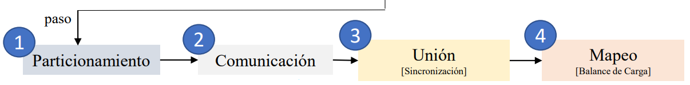

## Example 1

- Data:

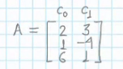

- Task:

> Multiply c_0 by 2  
> Add 1 to c_1

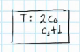

1. **Partitioning**: partition the problem into smaller problems; we can use task or data partitioning.

    1. If we use the **parallelism of tasks** to partition the Task T into its two smallest components, since it has two operations: 

    2. If we use the **parallelism of data**, the Task remains the same but we have a **Task T copy** for each of the data parts we divide data into. Thus, we have **three tasks that are identical** over each data part (line of data).

    

2. **Communication**: draw a communication channel through the pair of tasks that communicate between each other. In this example, there is no need for any communication. **Communication** is absent: 

    1. In the first case, t_1 and t_2 are **independent** from each other.
    
    2. In the 2nd case, neither of the three task copies need any data from another copy, so they are also **independent**. *Thus, we don't need any lines*.

    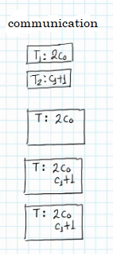

3. **Union**: link tasks in a bigger sqauare if necessary. That is, if the tasks are very small and there is **dependency** between them, we can **serialize them** and use that to say that they should be executed by **the same processor**. In this case it is not necessary, but we can do it to see how it works with bigger tasks:

    1. We can make a bigger sub task by joining both tasks into one.

    2. We could also create 2 sub tasks by joining the *first and second copy* into one sub task, and *third copy* into another sub task.

    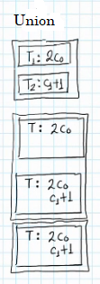

    **On what do we base ourselves to link 2+ tasks into one bigger sub task?** Reduce the serialization / communication is very important: **link the tasks where there is serialization / communication / dependency** so that they are executed in one processor as a bigger sub task.

4. **Mapping**: how many processors do we have? Let's say we have 2 processors. This means we need to do the Load Balance. *The quantity of tasks to execute in parallel is independent of the quantity of processors*.

    1. We have one sub task, so we can only assign it to one processor (1 task, basically). Had we not linked the two tasks, we would have one task per processor (if they are independent). When we link, we can choose the order of tasks inside the bigger sub task. 

    2. We have two sub tasks (two tasks), so we can give one sub task to one processor and the other sub task to the other. Had we not linked any task, we  would have 3 tasks that are **independent**, but only two processors, so p_1 would have 2 tasks and p_2 only 1 task. p_1 has 2 tasks, so they are **serialized (same processor, different data)** even though they are **independent**, since the amount of processors (2) is smaller than the amount of tasks (3).

    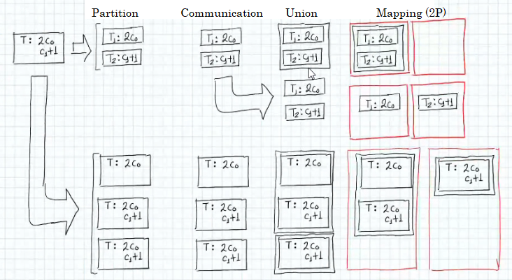

    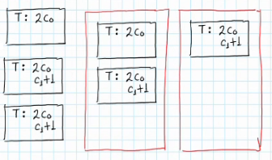

## Example 2

- Data: the vectors:

> x_1 = (2, 3, -2)  
> x_2 = (1, 2, 0)

- Task: the dot product:

> x_1 * x_2 = 2(1) + 3(2) + (-2)(0)

1. **Partition**: this example cannot be split by data and use identical tasks, and so the best way is to partition by tasks: one of multiplication a*b and the other of the sum a + b + c (two sums). The multip have to be done **first**, so there's **dependency**. We have 3 tasks of multip and 1 of sum = **4 Tasks**.

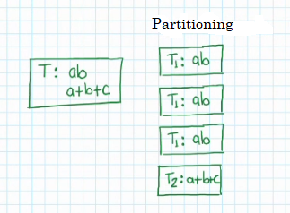

2. **Communication**: check whether or not there needs to be communication among the total 4 Tasks. There **is** the need of communication, since the sum Task **needs the result of Task 1, 2, and 3** of the multiplication Tasks. There is communication since **Task requires other Tasks' results.** Thus, we draw the communication lines / arrows. 

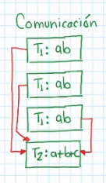

3. **Union** of Tasks: given that we have **dependendency** / **communication**, we can link Tasks so that **one executes after another**. Take on account:

    - The 3 multiplication Tasks can be executed in **parallel**, since there is no **dependency** / **communication** among them. So, they can be **executed in different processors**.

    - **Each** of the 3 multiplication Tasks is **serialized** with the sum Task.

    - Every Task you link in a bigger sub task, will be executed in **sequence**, or in the same **processor** (as they become a single Task).

    - Since there is **dependency** with Task 4 over Tasks 1,2,3, 

    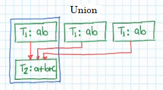

    - This union is as such above, because we need dependency / serialization / **union** between Task 1 and Task 2, but we cannot link all copies of Task 1, since that would mean to serialize them: by leaving them out, we are enabling them to be **parallel**. **When we link in a sub task, we serialize**. We could link with any copy of Task 1.

    - As we made a bigger sub task, we need to update **communication** lines, because the communication needs to be expressed **in terms of the new tasks**. Also, update the inner tasks' communication:

    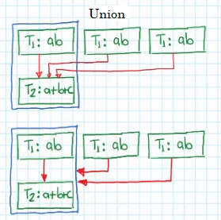

4. **Mapping**: load balance in the amount of processors. Let's say we have 2 processors again. Overall, we have 3 Tasks: 

    - we could do: 1 processor with 1 Task and 1 processor with the other 2 Tasks. But look:

    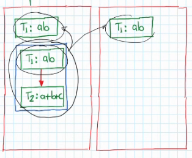 

    - We have one **double task** together with another in a single processor. We can better distribute if we look at it as 4 Tasks:

    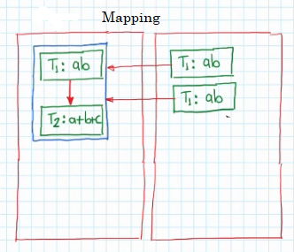

    - Update communication. Now we have inter-processor communication. However, p_1 **has to wait after its linked copy of T_1 until the other copies finish and it can proceed with T_2**.

    - We are winning time performance, in the execution of these two Tasks in parallel: (everything else is sequential)

    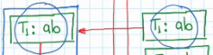

The time diagram would look as follows:

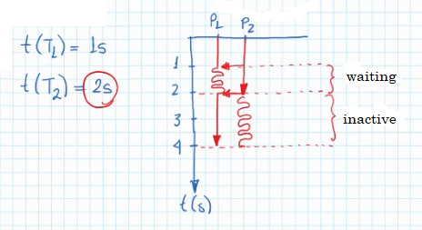

If we had 3 processors, all copies of Task 1 can be in parallel and Task 2 being the only one in series.

- **The need of Mapping** obliges us to do the **Load Balance** (or equilibrium in work) among the processors. And this need of **Load Balance** is the one that makes us need a **Task Planner**. The Task Planner is anothe program that assigns Tasks to processors, and thus consumes resources. The Planner must **not be so complex** that it overloads the processors as well.

# Types of Processing

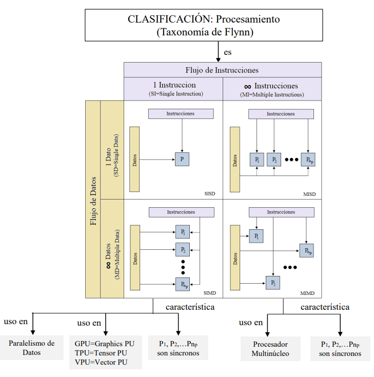