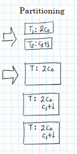

# The Foster Method: Examples

- Tasks that are **independent** can be **parallel**.

----

## Example 1

- Data:

- Task:

> Multiply c_0 by 2  
> Add 1 to c_1

1. **Partitioning**: partition the problem into smaller problems; we can use task or data partitioning.

    1. If we use the **parallelism of tasks** to partition the Task T into its two smallest components, since it has two operations: 

    2. If we use the **parallelism of data**, the Task remains the same but we have a **Task T copy** for each of the data parts we divide data into. Thus, we have **three tasks that are identical** over each data part (line of data).

    

2. **Communication**: draw a communication channel through the pair of tasks that communicate between each other. In this example, there is no need for any communication. **Communication** is absent: 

    1. In the first case, t_1 and t_2 are **independent** from each other.
    
    2. In the 2nd case, neither of the three task copies need any data from another copy, so they are also **independent**. *Thus, we don't need any lines*.

    

3. **Union**: link tasks in a bigger sqauare if necessary. That is, if the tasks are very small and there is **dependency** between them, we can **serialize them** and use that to say that they should be executed by **the same processor**. In this case it is not necessary, but we can do it to see how it works with bigger tasks:

    1. We can make a bigger sub task by joining both tasks into one.

    2. We could also create 2 sub tasks by joining the *first and second copy* into one sub task, and *third copy* into another sub task.

    

    **On what do we base ourselves to link 2+ tasks into one bigger sub task?** Reduce the serialization / communication is very important: **link the tasks where there is serialization / communication / dependency** so that they are executed in one processor as a bigger sub task.

4. **Mapping**: how many processors do we have? Let's say we have 2 processors. This means we need to do the Load Balance. *The quantity of tasks to execute in parallel is independent of the quantity of processors*.

    1. We have one sub task, so we can only assign it to one processor (1 task, basically). Had we not linked the two tasks, we would have one task per processor (if they are independent). When we link, we can choose the order of tasks inside the bigger sub task. 

    2. We have two sub tasks (two tasks), so we can give one sub task to one processor and the other sub task to the other. Had we not linked any task, we  would have 3 tasks that are **independent**, but only two processors, so p_1 would have 2 tasks and p_2 only 1 task. p_1 has 2 tasks, so they are **serialized (same processor, different data)** even though they are **independent**, since the amount of processors (2) is smaller than the amount of tasks (3).

    

    

## Example 2