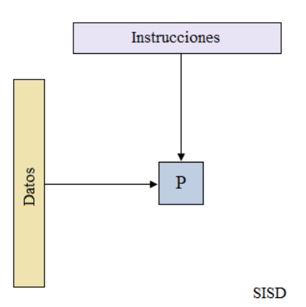
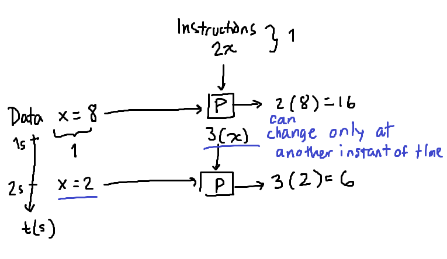
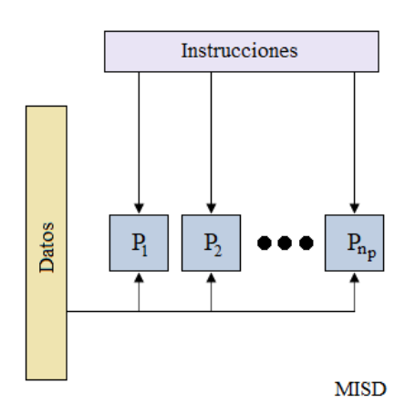
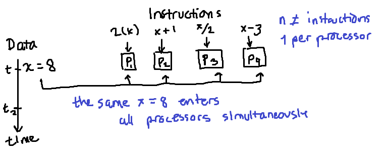
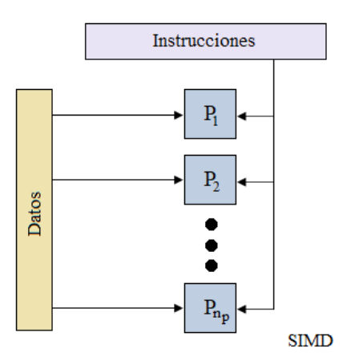
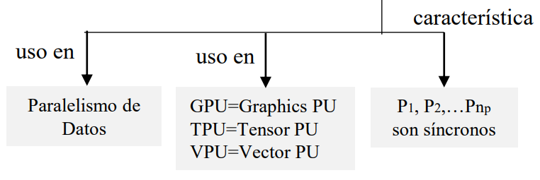
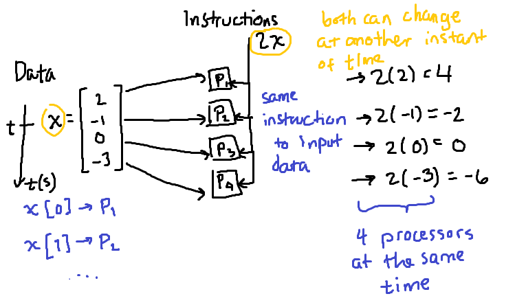
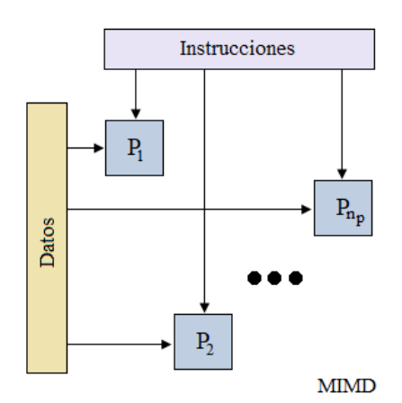
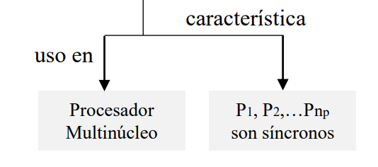
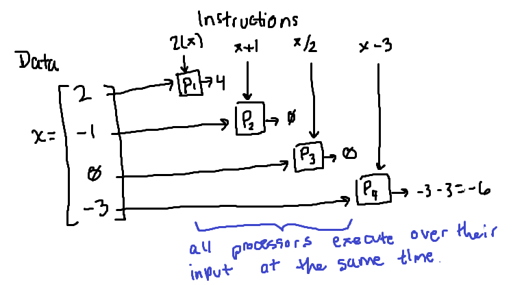

# Flynn's Taxonomy

There are 4 configurations about how can we compute calculations in a PC.

- The first dimension is the stream of instructions and the other is the stream of data. Each dimension can be partitioned or not, which gave us: many instructions/data or 1 instruction/data. This combinations gave us the four cells in the diagram.

1. **SISD (Single Instruction, Single Data)**:

- Data: 1 data value at a time (t)

> x = 8

- Instructions: 1 instruction

> 2x

If we want to change either the data or the instruction, it needs to be **at another instant in time**. The instructions come from the **source program**. Only one instruction and one data value stream at a time *t* inside processor P.

2. **MISD (Multi Instruction, Single Data)**:

Here we got many instructions and only 1 data value:

- Data: 1 data value at a time (t)

> x = 3

- Instructions: n **different** instructions (n processors):

> p_1 = 2x  
> p_2 = x + 1  
> p_3 = x / 2  
> p_4 = x - 3  

The same data value (x = 3) wil enter **n times** (n processors), and since we got n processors, we can execute **n different instructions** over the same data value that entered at instant *t* each of the n processors. 

3. **SIMD (Single Instruction, Multi Data)**:

- Data: n data values at a time (t). The input will be a **vector of size n** (n processors).

> x = [2, -1, 0, 3]

- Instructions: 1 instruction

> 2x

We can have more processors, say P_1, P_2 and P_3. In this case, the **data needs to be a vector** of size n (n processors). Each number *i* will enter its corresponding processor *i*, all n data values enter its processor at the same time. This is the model of programming that GPU's use. This is the model **for each unit of time**.

On another **instant of time** *t*, the instruction can change (2x) or the data vector itself can change, but on another instant of time.

- Synchronous: all processors begin execution of their instruction at the same time. After one instruction, the quickest processor needs to wait for all others to finish theirs in order to continue, **since they use the same clock**.

4. **MIMD (Multi Instruction, Multi Data)**:

- Data: n data values at a time (t). The input will be again a **vector of size n** (n processors).

> x = [2, -1, 0, 3]

- Instructions: n **different** instructions (n processors) at a time (t):

> p_1 = 2x  
> p_2 = x + 1  
> p_3 = x / 2  
> p_4 = x - 3  

The first data value of the vector will enter p_1, the second p_2, etc. at instant *t* of time, that is, **simultanously** all processors execute their instructions. This is the processing model that today's processors use: they have multiple nuclei (processors) and so they can process many data in many processors **simultaneously**.

The processors are synchronous as well: after one instruction, the quickest processor needs to wait for all others to finish theirs in order to continue, **since they use the same clock**.

# Another Classification: Based On Memory Access

Types:

1. **Shared Memory System**: 

Many processors, say 4, are connected in a system (a chip with 4 nuclei). What we do now is have **memory (RAM)**, and **all processors can access this same memory space (RAM)**, which is represented in the diagram with a square M. They share the memory through an **interconnection network** that connects all the processors to the same memory. This **slows** down the programs, since memory access is 100 times slower than an operation execution. Thus,

- Minimize the memory accesses as possible, and therefore, make every processor's access to RAM to take as much data as possible, in order to make **RAM memory seem faster**.