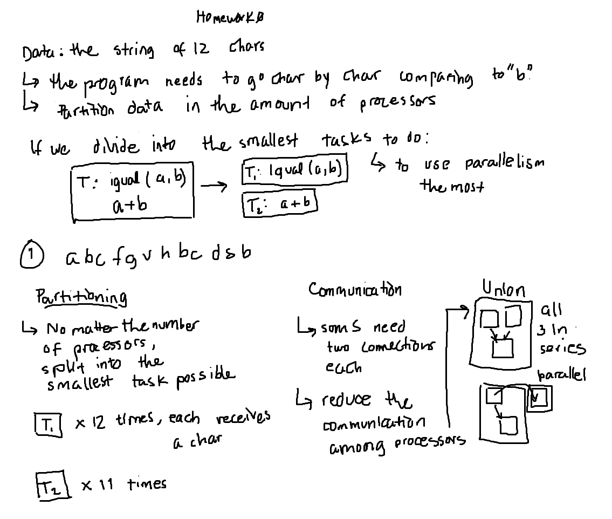

# Homework 0: Solution

1. **Partition**: always divide into the **smallest Tasks possible, no matter the amount of processors.** Here we have 12 `equals(a,b)` and 11 `sums`: we break into 12 copies of T_1: a==b and 11 copies of T_2: a+b.

2. **Communication**: As we broke down T_2 = a_1 + a_1 + ... + a_11 into 11 sums, we draw communication lines explaining *how those 11 sums are done one by one*.

3. **Union**:

We start to decide: the **top three squares depend on each other**, but if we link all three, the two copies of T_1 will be done in **sequence**. Therefore, we only link **one copy of T_1 with T_2** and leave the other T_1 copy to do in **parallel**. This always happens when **many copies of T_1 are used for one T_2**.

But anyhow, we need to group **further dependencies into one**. There is one dependency that is linked and the other than can be left in parallel:

*Note: basically, do not link Tasks that are on the same level of processing, since they can be done in parallel and later communicate its result.*

Rearranging for presentation purposes:

4. **Mapping**: 

- 12 processors: Since we have as many Tasks (subtasks linked become 1 Task) as we have processors, we can simply put 1 Task on each processor, **leaving the biggest Task alone in 1 processor**, which is always our best scenario in time performance optimization.

- 6 processors: Since the Partition was into **the smallest Tasks possible**, the process of Partition, Communication and Union does not change if we reduce the amount of processors.

    1. The first step is to **locate the biggest Task and assign it to one processor**, then the second biggest Tasks into the remaining processors, and so on, until **we finish filling p processors with 1 Task**.

2. In p_4, p_5 and p_6 we assign 3 of the remaining small Tasks, since these **processors have the least load**.

3. Once we have **1 processor with the biggest Task**, but the **others still have less Tasks than p_1, we keep filling one by one** of the remaining small Tasks, avoiding the processor with the biggest Task.

