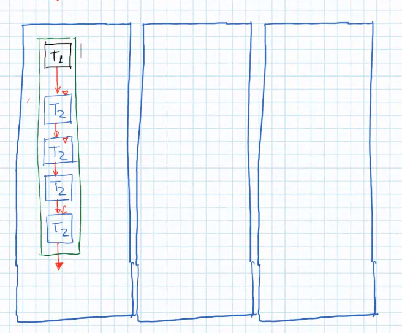
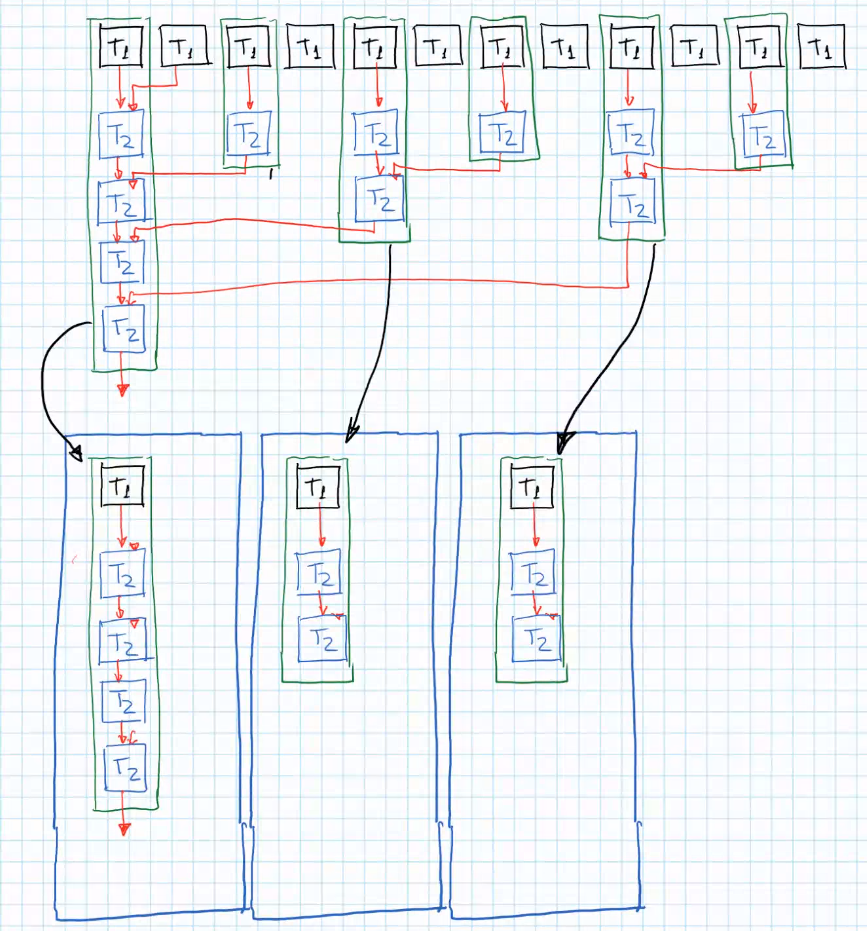
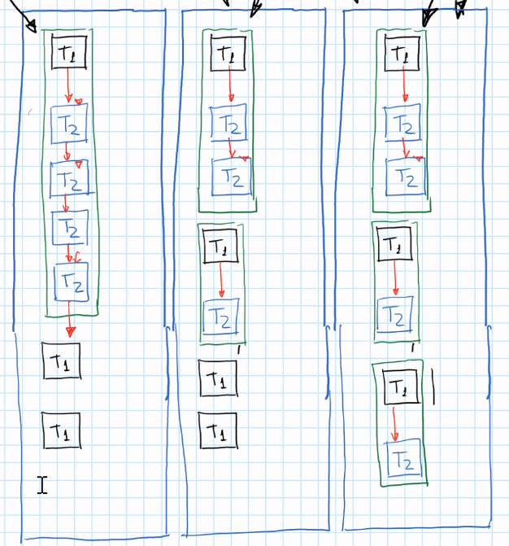
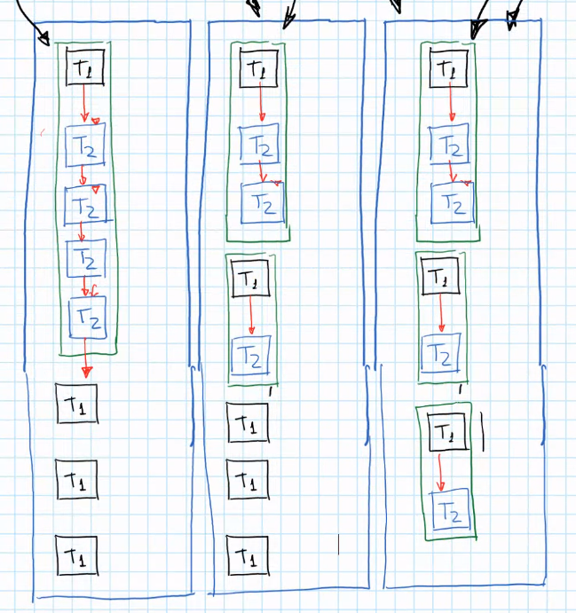
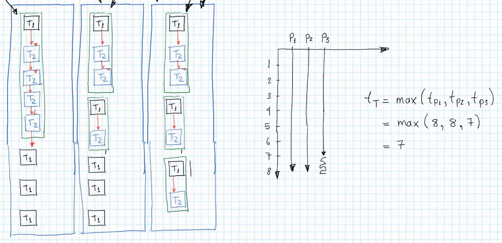
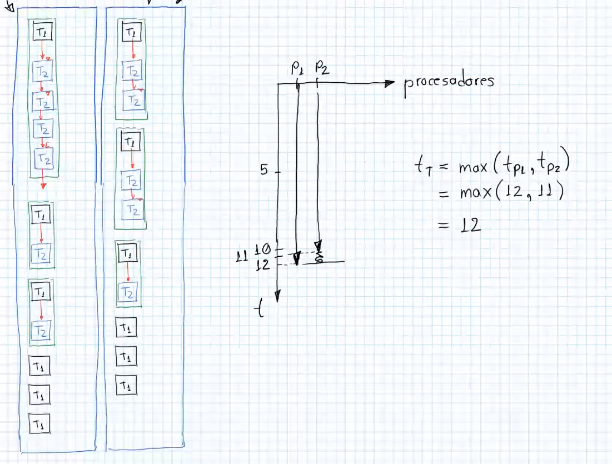
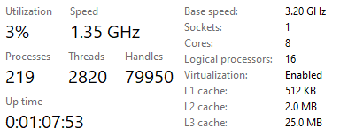

# Homework 0 - Solution Pt 2

- 3 Processors

    1. We proceed by assigning the biggest Task as well.

    

    2. We continue by assigninging the two second biggest Tasks, **one in each processor** until we run out of processors. Coincidentally, we got 2 of this biggest Task size, so we can put those 2 in the 2 remaining processors, **avoiding the one that has the biggest Task**.

    

    3. Now we continue assigning the next biggest processes: but we can no longer use empty processors, so we assign them, always trying to avoid the processor with the biggest Task. We first assign two of the three biggest Tasks so far. 
    
    
    
    All the processors last the same, but we still have 1 remaining bigger Task of two subtasks. Since we have **all processors** with the same load, we can assign it to **any porcessor, including the one with the biggest Task**.

    

    4. Continue with the next biggest size remaining, until **all processors have the same load**, and we still have 2 Tasks left. Thus, we can assign them to **any processor** once again. 

    

The suggestion is to grab the N current biggest Tasks (N processors), and assign them 1 to each processor. Then, what follows is to grab the remaining Tasks of that current biggest size and fill them **to any processor**, since all processors have the same load. Continue with the **next current biggest size** in the same way.

*Note: we skipped the dependeny / communication, and thus it may require more waiting in the time diagram. Inside every processor, you can move the order of the Tasks if they need to be done in a certain order for this dependency. **Inside each processor, you can change the order of the Tasks, as they are anyway done in series / sequentially.***

- 2 Processors

# Memory Access: Classification

Memory Access: the access that the processors have to RAM Memory (Main Memory), since it is in the RAM where the program (Task) is and also the variables while the program executes. The OS copies the source program from Secondary Memory to RAM since it is faster to work on RAM.

It has two types:

1. **Shared Memory Systems**: basically all PCs, the have the following structure:

    - They have a series of Processors, p_1, p_2, ..., p_n. All processors use the same memory space (RAM). They share it *through* an **interconnection network**, one for all processors: this network is the main issue since it is one for all processors. That is why every processors' access to RAM needs to grab **the biggest amount of information it can** so that the processors **minimize the number to accesses**.

    - The communication between the processors is done **through memory**: if one processor needs to communicate with another, it needs to store a message in memory variables, so that the other processor can access the space in memmory with the message.

    - We have different APIs to program in parallel, we have three types: 

        - C++

        - CUDA (Compute Unified Device Architecture): GPUs are intended to process 3D graphics (matrix processing), but people wanted to process Neural Networks, since it also involves matrix processing. That is why NVIDIA launched the interface called CUDA: allows different purpose usage of GPU processors.

        - Open MP: allows communication to GPU or through threads using RAM. 

    > Intel invented the **logical processors** technology, which is a virtual way of managing hardware. That's why it says 8 nuclei (cores) but 16 processors. What it means is that we have 16 (micro)processors in software terms, but in hardware just 8. Thus, we got 16 processors for Tasks. The GHz speed is the speed of the **clock** inside the CPU, and the speed of the clock is the speed of the CPU to do one operation.

    

2. **Distributed Memory Systems**: it has a different structure,

    - Each processor p_i has its **own** physical memory (RAM), and this processor p_i has access only to its memory space.

    - If we need inter-processor communication, we do not use memory, instead we use a **real interconnection network**, which involves messages not stored in memory, and instead the message is **sent through the communication network**.  An example is Data Bases, where we do not have access to the processors but only to messages through SQL.

    - It is *distributed*, since the memory is **distributed** in different devices, which are the processors with its corresponding own memory. 

    - We have 2 APIs or usage interfaces:

        - MPI (Message Passing Interface)

        - UP C++ (Unified Parallel C++)

    - This distributed memory systems are usually inside **cloud systems**.

