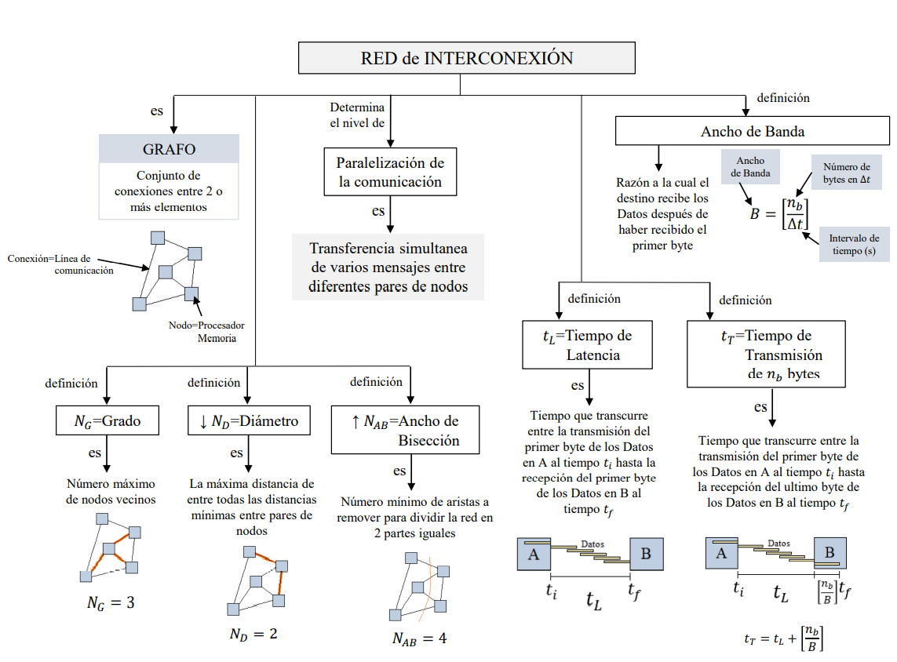
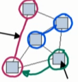
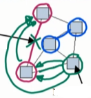
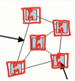
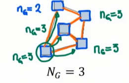
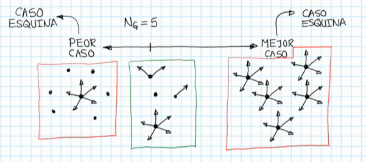
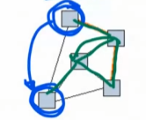
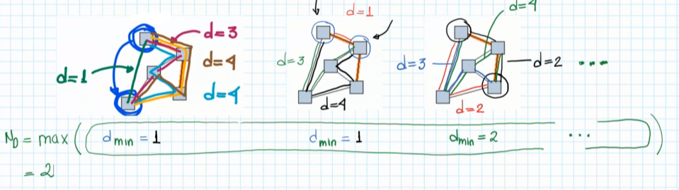
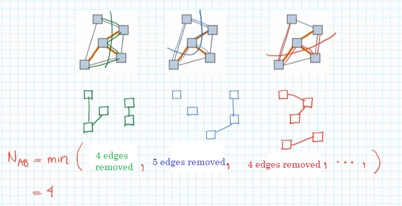
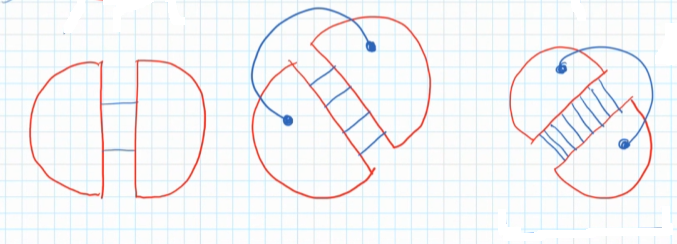

# Interconnection Network

An **Interconnection Network** is basically a **graph** structure, which has a graphical visualization. The graph will be then a set of connections between two or more elements: **lines** connect **nodes**, and they represent the **line of communication**, and a **device**, respectively. Each of these devices (nodes) can be a RAM memory or a **processor in a system of either shared or distributed memory**.

Why this graph? The more lines we have in the graph, the more parallelism is allowed to happen in the system. If a processor wants to communicate with another, and they are connected directly with an available line, **the communication is parallel**, which means that the number of lines is the number of parallel messages the processor can send/receive.

But what happens if the line of communication is being used by another processor? You need to jump to various processors that would connect the sender to the receiver and **wait for the channel to be available**, being thus an intermediary communication, since we need intermediate processors to bridge communication between far apart processors.

If we take a look at the structure of Shared Memory (a simple graph as well), we can see that **there is only one line* that connects** all the processors with the RAM Memory, which means that the **comunication is restricted** and **only one processor can communicate at a time with the line of communication**. Also with the Distributed System we got only one line shared by **all processors**, and thus only one processor at a time can use the line of communication. That is why we say that each *available line* of communication will be *a parallel message* between the devices that it connects.

*Here is a graph of a Distributed Memory System.*

Therefore, we say that the **interconnection network** determines the level of **Parallelization of Communication**, which is the simultaneous transference of various different messages between different pairs of nodes.

### Parameters That Define a Good Network

There are 3 parameters that tell us how good the communications is in the network:

1. **Grade, N_G**: the grade is a number, which represents the **maximum number of nodes that are neighbours to one node**. Check the neighbours of each node and grab the maximum grade of all nodes. A node is a neighbour of a node if it is **directly connected** to the node. WSe can define the **grade of a node** (n_G), which will be the number of neighbours it has.

The grade is useful since it is a way of telling how many communication connections we have at most: if N_G = 5, it says that **at most** we can have **N_G = 5 parallel messages**, *if we happen to use that node* for a certain communication. The best scenario (*Corner Case*) is that all nodes have N_G = 5 neighbours, where we have the maximum communication possible for an N_G = 5 system; and the worst scenario (*Corner Case*) is that only 1 node has N_G = 5 connections and all the others have no connection. All the other possible scenarios (*Intermediate Cases*) are between the two *Corner Cases*.

2. **Diameter, N_D** of a network: it is a number, that represents the maximum distance among all minimum distances between any pair of nodes' paths **without cycles**. This number means that **any pair of nodes at most will have N_D edges between themselves**. The more lines of communication between two nodes' paths, the **slower it will be**. Thus, this measure tells us at most the slowest communication in any pair of nodes nodes' paths.

    - **Distance** is measured as the number of edges needed to arrive from node 0 to node 1. The node 1 can involve a path that passes through a node/edge twice (cycles), but we always count the edges we walk through until the arrival to node 1. Anyhow, when calculating the N_D, we do not count the cycle paths.

    

    *Example of a cycle path: an edge is covered twice or more.*

    - We thus grab **every pair possible of nodes** and measure the **minimum distance** node 0 has to its node 1, and so on, and at the end grab the **maximum of those minimum distances** for each node, without counting the **cycle paths**.

    

    - The idea is to **minimize** the N_D number, since the communication will be faster because the waiting for availability decreases if there are less edges to travel from onde node to the other. In the network try to have the **minimum diameter as possible**.

3. **Bisection Width, N_AB (N_BW)**: it is the minimum number of edges that we need to remove in order to divide the network into two equal (or almost equal) parts. 

    - In this example, since we have 5 nodes, we will have one piece with 3 nodes and the other with 2 nodes.

    

    - We need to check **all possible ways of partitioning** so that we can calculate the N_AB number.

    - N_AB is the minimum edges that connect two parts, that is, **how well are the two parts connected**, which means how parallel can the both parts work: the **less amount of edges** removed mean that we are **more restricted** with the communication. We thus look for the most restricted (minimum) case.

    