# Interconnection Networks Pt II

There exists another definition,

**Band Width**: it is a measure of how many *bytes* are being transmitted through the network. That is why it says that it is the ratio calculated after the moment the **receiver gets the first byte** of information: at this moment, the receiver starts counting the bytes received in a time *t* (time interval in which those bytes where received). 

- **Time** is usually measured in **seconds**, and thus the interval is expressed in seconds.

- An example: Let's suppose that we have a Transmitter (T) and a Receiver (R), which are two nodes in the network and are connected through the said network. The message the transmitter sends is a string `a2bcda`. If we suppose that this message is transmitted in an interval of **3 seconds**, **what is the band width?**

> BW = (n_b / B) = bytes / time = 6 / 3 = 2 bytes/s

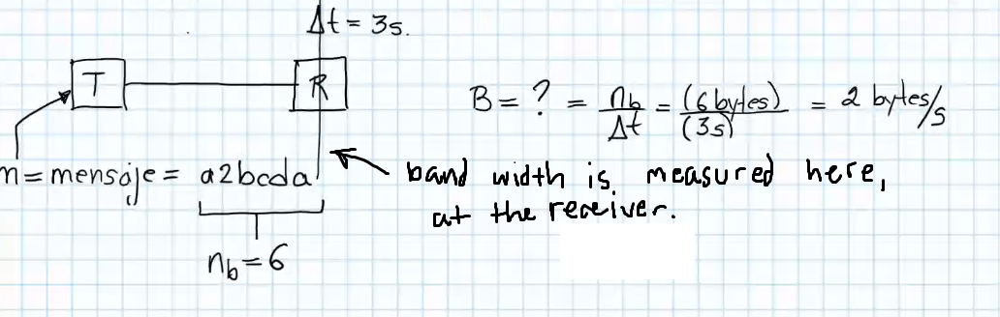

*Note: Suppose the bytes of all the string are the number of characters (6). Commonly in communications, they information is sent per byte, instead of bits. So, to send any character, a whole bit is sent.*

We also distinguish another concept,

**Latence Time L_T**: it is a consequence of electronics. **The time that a device is taking to respond is what we call latency**. Formally, it is the time it takes the first character from going out (being sent) from A at time *t_i* until this first character arrives in B at time *t_f*.

- Suppose A is the transmitter and B is the receiver. A single rectangle is a sequence of characters that A transmits. In this way, when the string goes out of A (when data goes out), the t_i time starts at this instant *t* when **the first character goes out of A**. Thus, t_f (final time) is the instant *t* where **this first character arrives at B**.

- In nature, nothing travels faster than light. Therefore, we cannot expect devices to communicate faster than that.

**Transmission Time T_T**: the time that passes since the transmission of the first character / byte from A at time *t_i* until the reception of the last character / byte in B at time *t_f*.

- In the diagram, t_i is the moment in time where the the first character starts to be transmitted, and when this first char is received in B was the t_f of **Latency**, but we now want the time until **the whole string arrives**, for which we use the Band Width calculation:

> T_T = T_L(t_f - t_i) + (n_b / BW) = T_L + (n_b / BW)

Here, we suppose we know the Band Width and the length of string (bytes number), and thus we solve for delta time:

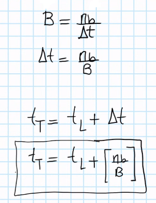

- An example:

Suppose that this is the data given,

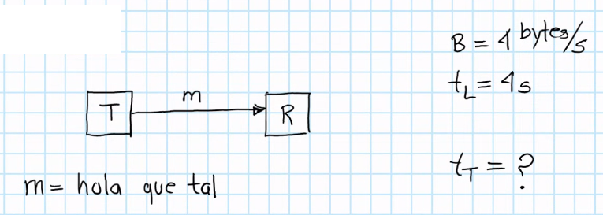

and we solve it as follows,

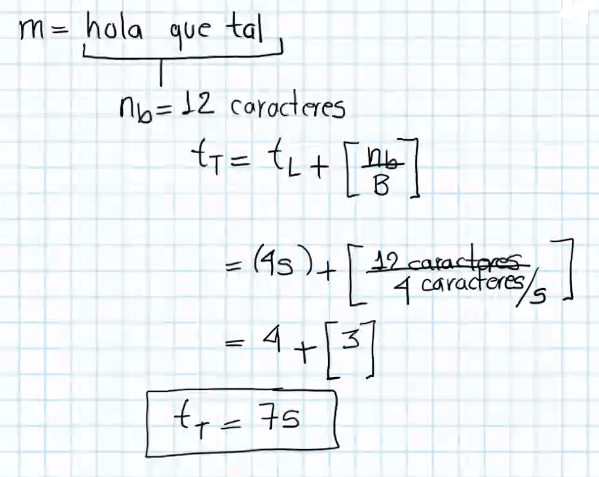

*Note: assume bytes = number of chars.*

> Everything that is digital, is controled by the clock, which is a voltage signal that looks as below. Processors need this clock to mark the time of any operation, and thus **Band Width** is constant every time.

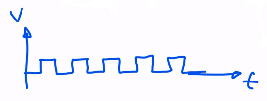

# Interconnection Networks: Types

There are two mayor types:

1. **Shared (a)**: the same line of communication is shared through many nodes. There is only one communication line, and through this line only string of bytes can pass, so if one of those 3 devices (Processors P) want memory access (M) and it is being used by another, processor P needs to wait. 

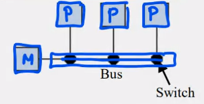

If P_1 and P_3 are communicating, and suddenly P_3 needs memory, it needs to wait until communication with P_1 is over.

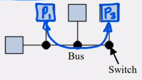

- An example is the Bus in a CPU: it is a single communication line that connects all processors to RAM memory. We say it limits the scalability, since it is one line shared through N devices.

2. **Conmuted**: this type uses *switches* to connect pairs of nodes. There are 3 sub types:

- **Indirect**:

- **Direct**:

    - **Linear**: basically have all devices connected to the next in **a line**. The problem is that if we want a device to communicate with a device that is not directly next, we need to communicate through the devices that are in between. The only devices that can be connected in parallel are the ones next to each other: thus, **three pairs** can be communicated **at the same time (parallel)**. Thus: N_G = 2 (maximum number of neighbours); N_D = 3 (n_p - 1) (we want to minimize), maximum distance of the minimum distances between nodes; N_BW = 1 (we want to maximize), since we divide the graph into 2 equal parts and the connection is through *1 line*.

    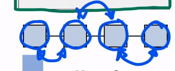

    *Note: n_p is the number of devices or number of nodes.*

    Thus, in order to minimize and maximize the mentioned (N_D and N_BW), we got:

    - **2D**: all intersections in the grid are a device. All marked pairs can be connected in parallel. We increment the N_BW as desired.

    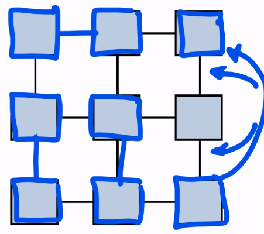

- **Transversal lines (a)**: all devices can be connected with any other, that is why the diagram shows a grid-like connection. Therefore, all pairs of devices can be connected. All the dots in the diagram mesh is a **swicth**, and they connect one line with another, one device with another. If we want cmmunication between P_3 and M_2, we connect by turning on the swith in the circle. 

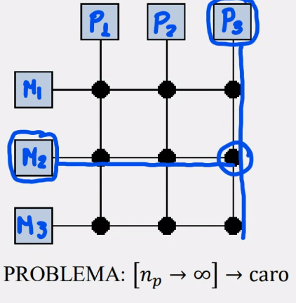

This particular grid allows us to have 3 simultaneous pair-connections, since we got basically 6 cables.

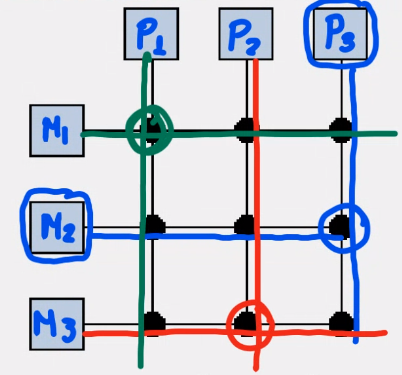

We say that it is an expensive method of connection, because if we got n processors / devices that tends to infinite, the need to grow the amount of switches and cables **by a square**.

*Note: (a) are used in **shared memory systems**, all other types are used in **distributed memory systems**.*

