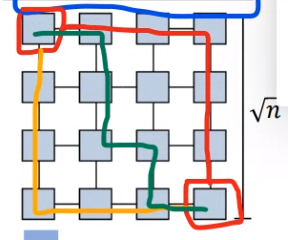
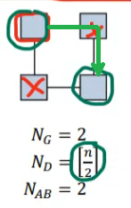
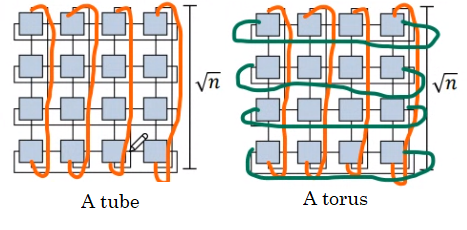
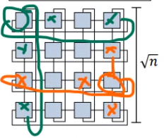
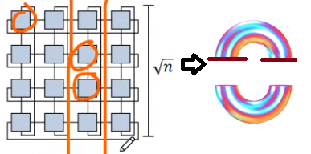
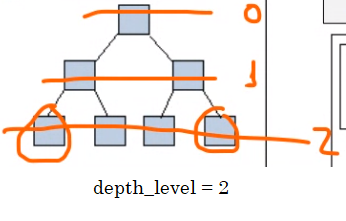
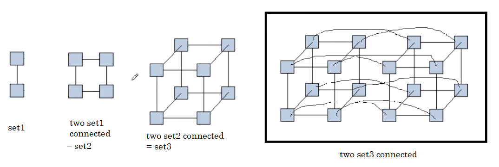
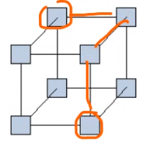
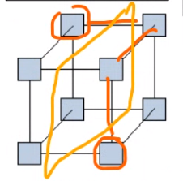
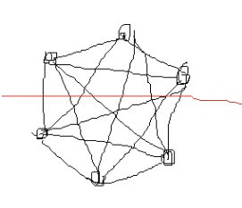

# Interconnection Networks Pt III

- **2D**:

Consider *n* = number of nodes.

If we want to minimize N_D and maximize N_BW (N_AB), we increase the dimensionality to **2D** type of network. `sqrt(n)` gives us the nodes per dimension, considering the grid is a square. N_G = 4, and:

> N_D = 2(sqrt(n) - 1) 

Since the red path is the minimum of connections, where each part is (sqrt(n) - 1). This, in comparison with N_D = n - 1 for Linear type, **minimized / reduced N_D**.

Did the N_BW maximize with a 2D grid? **`sqrt(n)` will always be greater or equal to 1**, so it did maximize as we wanted.

> N_BW = sqrt(n)

- **Ring**: it is a way given by connecting a Linear network in its extremes, which forms a ring. Did we improve Linear as we want? Let's analyze:

    - N_G doesn't change from what Linear gives, **it is a constant, always 2**.

    - N_D = n / 2, as with any squared diagram, the largest way of arriving to one node to the other is always the path in green:

    

    And thus it minimized as we wanted.

    - N_BW = 2, it is **always 2**. In comparison with Linear as well, the N_BW is maximized.

- **Torus**: we get this type by doing also a double connection as with Linear-Ring, but now withthe 2D type. **Our goal is the same: to minimize N_D and maximize N_BW (N_AB).**

    - N_G = 4 **in every case**, 

    

    - N_D = sqrt(n) - 1 (but often sqrt(n))

    - N_BW = 2 * sqrt(n) which looks as follows (we need to do **two cuts** in order to have the graph totally cut in half),

    

    In comparison with 2d type, we accomplished the goal.

- **Tree**: this is a binary tree form,

    - N_G = 3, since the maximum number of neighbours to a node are **its parent and two children**.

    - N_D = depth level * 2 = 2 * 2. Considering the farthest nodes are:

    

    This form is useful since it is a tree with various children, and then as n grows, **the diameter gets smaller**. The furthest nodes are the two extreme leaves, and so the path its **depth * 2** because the path is to go from one leaf to the root and from the root to the other leaf.

    - N_BW = 1

- **Hypercube**: *hyper* because we can use n dimensions of a cube.

    - From the Torus to this, the N_BW is increased, which is desired. The price to pay is that we need to increment the number of nodes. The pattern as to how the dimension of a hypercube network with different dimensions is:

    

    *Note: the hypercube can have a similar figure to Linear and 2D networks*

    - N_G = d, where *d* is the number of dimensions.

    - N_D = d, as well the number of dimensions. Since the furthest nodes are:

    

    - N_BW = (n / 2), if we cut the graph with a plane, and thus cuts **4 connections in this case**:

    

- **Completely Connected**: very costly due to the amount channel, this is connecting all nodes with all the remaining:

    - N_G = n - 1

    - N_D = 1, **every time**, since all are connected.

    - N_BW = (n^2) / 4. If we cut by half, we cut 9 connections.

    

    *Note: here, if we got even number of nodes, the N_BW formula is exact, but if we got an odd number of nodes the formula is an approximation.* 

