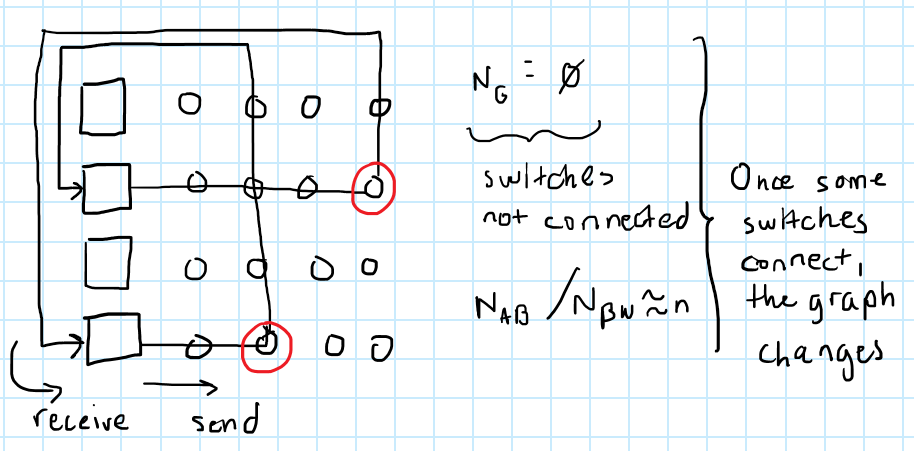
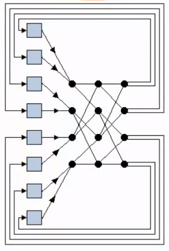
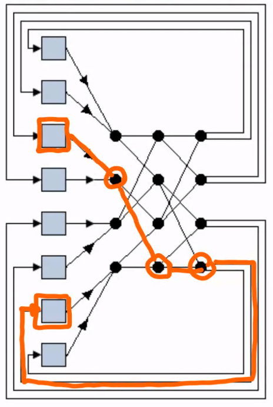
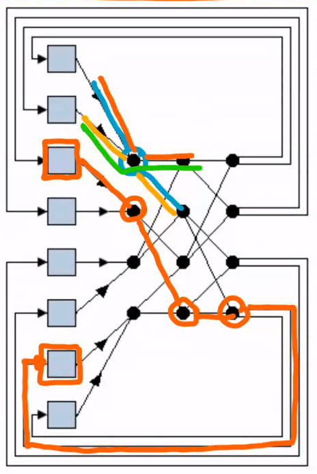
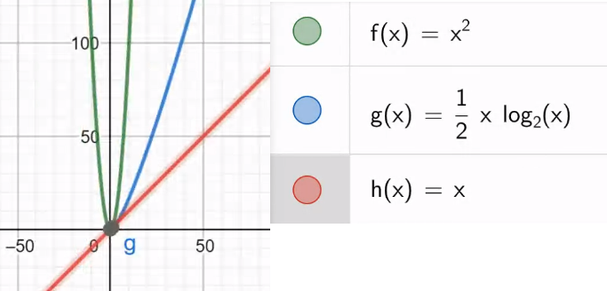
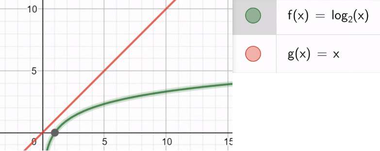
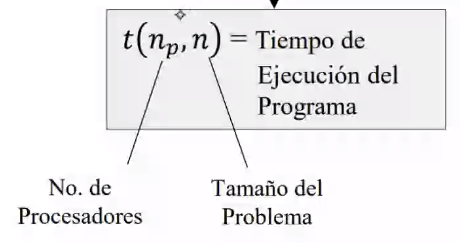

# Interconnection Networks: Types Part III

We left out a type of network:

- Indirect:

    - **Transversal Lines**: also we have a grid of switches / connections (dots) that connect the pairs of devices. The difference with the other Transversal Lines is that it can connect **all existing pair of devices**, instead of just connecting the x-axis and y-axis pairs.

    The connection between n_0 and n_1 is different from connection n_1 to n_0 (different switches): if you want to send from n_ you use one switch and if you want to receive with n_0, you use another switch. **Only one switch** is used per connection.

    

    All nodes can be directly connected using only **one line**. The problem is that, for n nodes, you need n^2 switches.

    They are **unconnected graphs** since the switches are off, so this calculations N_G, N_D and N_BW are better done once we connect some nodes for a particular case.

    - **Omega**: it also involves nodes connected directly with only one line of connections. However, we decrease the n^2 switches required using the structure below:

    

    If we want to connect the circled nodes,

    

    Each switch has 4 possible connection paths. Once we connect two nodes, the **exact same path** is blocked, that is, **the lines are blocked**, but the switches can be used up to 4 times as long as it is a different line coming out of them:

    

    N_G, N_D and N_BW? They are also **unconnected graphs** since the switches are off, so this calculations are better done once we connect some nodes for a particular case. Now, the number of switches depending on nodes (x) goes as follows:

    

    which, by using a logarithm, decreases from the x^2 seen before. Thus, it is a more advisable network when the number of nodes n is very large.

    *Note: by using a logarithm (base 2 or base e), we can decrease any function:*

    

# Performance

Two things are important to measure:

1. Time (Time Complexity): measured in abstract time units. What we measured in past chapters as a `max(t_0, ..., t_n)` function, now we formalize it: it formally is measured with a function called **Program Execution Time (t)** which also involves abstract unit of time. It has two variables:

    

    1. n_p: number of processors, since we are now in **parallel** we need to consider this variable.

    2. n: size of the problem (usually size of the input data), and this n could involve other variables. For example, we want to sort the numbers:

    > x = (2, 3, -1, 5)  
    > n = 4

    This is a mathematical function, i. e. `t(n_p, n) = 2*n_p + n = 14 units of time; where n_p = 2 and n = 10`, which will tell us **how long my program takes**.
    
    Why do we formalize it as a function form? So that we can identify the functions involved and determine quickly if the time complexity of our designed algorithm is **treatable** or not. This measure, since it uses n_p, we need **other measures**.

    These other measures are:

    1. **S = Speedup**: how much the acceleration of the machine increases/decreases, which is a function:

    > S(n_p, n) = t(1, n) / t(n_p, n)

    `t(1, n)` stands for the execution time if we use **one processor**, or in **sequence**; `t(n_p, n)` is the execution time of the same problem but solved with n_p processors, **time in parallel**. Both terms need to have **the same n**. Once we divide the two terms, expecting the sequential time to be **greater**, and thus **expected result of S would be larger than 1**. The larger the S is, the better.

    > If we have less or equal than 1, the **time in sequence** is being the same or better than the **time in parallel**, where parallelism is simply not useful.

    2. **E = Efficiency**: once again we have a two variable function:

    > E(n_p, n) = S / n_p

    The intuition of this is better described with an example: 
    
    - suppose n_p = 5, the ideal case is:

    > S(n_p, n) = t(1, n) / t(n_p, n) = 10 / 2 = 5

    The real case:

    > S(n_p, n) = t(1, n) / t(n_p, n) = 10 / 3 = 3.33

    Now we compute E

    > E = 5 / 5 = 1  
    > E = 3.33 / 5 = 0.65

    Thus, **in ideal cases the efficiency is 1**, which means that all processors are being used with their maximum capacity. **E < 1 means that the processors are not being used to the fullest**. In a bad case case where S = 1 (both parallel and serial last the same), the E = 0.2 and so on until 0. **0 <= E <= 1**. The closest to 1, the better.

    3. **C = Cost**: a two variable function:

    > C(n_p, n) = n_p * t(n_p, n)

    This is a measure of **how costly it is to have n_p processors**. It is not simply the n_p processors cost, but also multiplied by their time, their energy.

    Taking again the ideal case where S = 5:

    > C = 2*5 = 10

    Taking again the ideal case where S = 3.33 = (10/3):

    > C = 3*5 = 15

2. Memory Used (Spatial Complexity)

We want algorithms that minimize both concepts. 