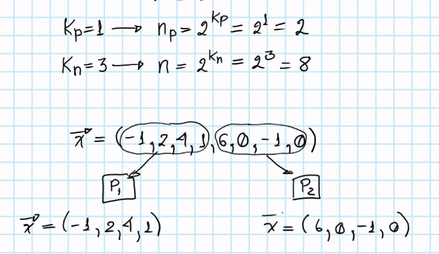

# Performance Part II

- **Computation to Communication Ratio (R)**: time that the processor takes to compute the needed calculations (time per calculation (Hz) multiplied by the amount of operations needed) over the communication time (time that the processor doing the operation takes to communicate).

- **Scalability**: there are two types:

    - **Strong**: It has to with with Efficiency: maintain the *n* constant (size of the problem) and increase the number of processors *n_p* and the **efficiency remains constant**, we are achieving **strong scalability** (the best case). What happens usually is that the more processors, the more communication and thus the **efficiency goes down**, and thus the system is **not scalable**.

    

    - **Weak**: In this case, if the strong scalability usually lowers when *n_p* increases and *n* stays constant we can still achieve this oether type of scalability. And thus, this scalability is a discovery: if you increase the *n* proportionally to the increment in *n_p* processors, and in this way the **efficiency stays constant**, we have a **weakly scalable system**.

    

    The increment of both *n_p* and *n* would be

    

    - An example:

    

    - Let's consider:

    `kn` is an integer, and it is known that *n* by itself increases according to an **exponential function**, when taking the operation as a series of sums:

    

    If we duplicate *n* according to this, the sum (n size) will the a number internal of sums that is complete: to solve a sum, we need to sum pairs, and thus we need **complete trees** by having *n* follow the exponential just mentioned:

    

    With these on account, *n_p* needs to increase proportionally to what *n* shows (and viceversa therefore), and thus also has the same exponential function, with base 2 raised to the power `kp` (integer):

    

    - Let's calculate:

        - In Series Case:

        We call the first case *kp = 0* the **Series Case** and the others **Parallel Cases**. The series case (only one processor):

        

        The number of sums is `n-1` for n numbers. Assuming each sum takes 1 unit of abstract time. We calculate the **Time Complexity**, which a function *t(n_p, n)*:

        

        Which in this case is:

        
    
        - Parallel Cases:

        We begin by having 2 processors,

        

        Which will be processed by these two as the tree below, 

        

        and the number of sums will be now:

        

        which has the time complexity:

        > *t(2, n)* = ((n/2) - 1) + 1 = n/2

        Now, let's continue with *k_p = 2* case:

        

        At the end we can see a pattern: n/n_p and kp. Thus, in general, the time complexity is:

        > *t(n_p, n)* = (n/n_p) + kp

        where kp is

        kp = log_2(n_p)

        And therefore,

        > *t(n_p, n)* = (n/n_p) + log_2(n_p) = log_2(2^(kp))

        Thus, the acceleration, efficiency and cost are:

        