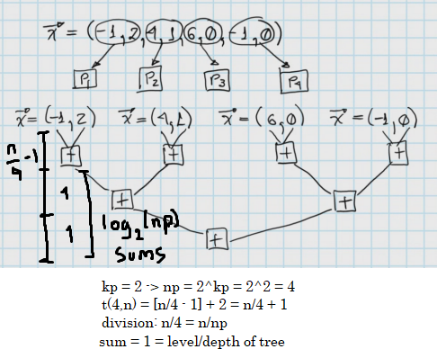
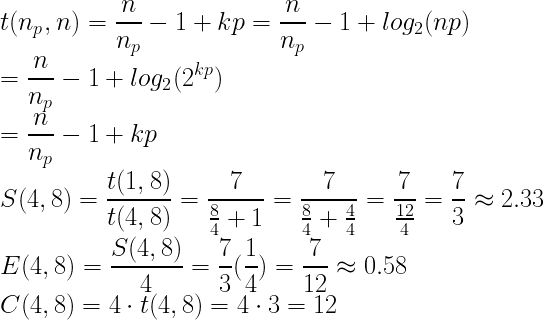
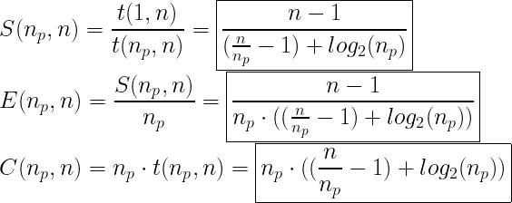
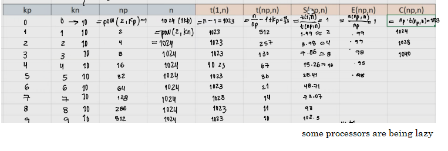
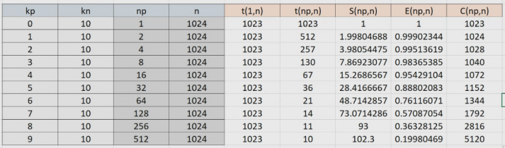
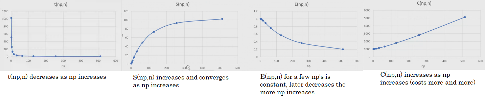
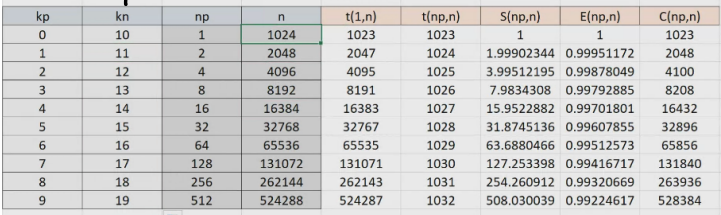
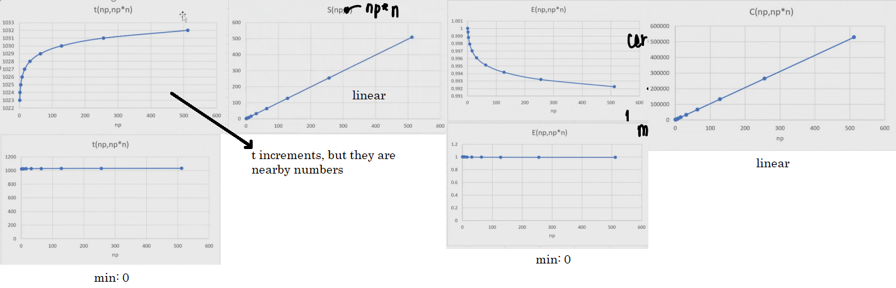

# Performance III

Following the example:

We can perform the calculations for Speed, Efficiency and Cost:

Now, the **corrected formulas are**:

## Excel Example

1. We start with the first 4 columns as the given info. By keeping *kn** a fixed number: 

And by calculating *t(1, n), t(np, n), S(np, n), E(np, n) and C(np, n)* we get:

If we now **plot the calculated 5 columns with respect to the number of processors:**

Therefore, we can conclude that **it is not a strong scalability because the efficiency decreases**, and this is due to **dependency**.

2. **Weak Scalability**: We start with the first 4 columns as the given info. By keeping *kn** as a **varying number**, and by calculating *t(np, np\*n), t(np, np\*n), S(np, np\*n), E(np, np\*n) and C(np, np\*n)* we get:

If we now **plot the calculated 5 columns with respect to the number of processors:**

We are now seeing how **communication** affects the parameters.