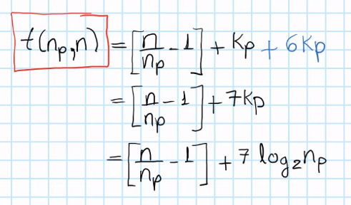
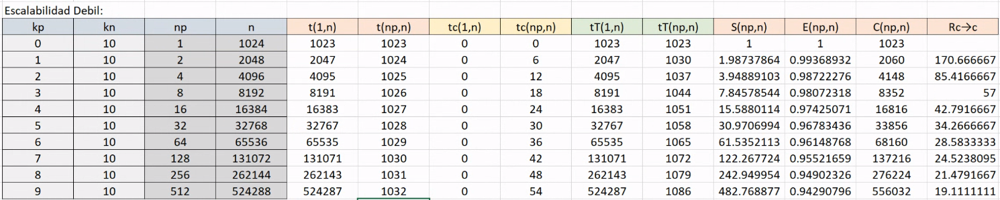

# Performance IV

The example will now include **communication network** in the form of a hypercube:

And the system is a **distributed memory system**, where the communication is through messages:

Thus each of the vertices of the hypercube is a processor with its memory. Taking on account the basic formula of:

We will **add at the end of this formula the communication time**, since it is only calculating the computation time.

We will say that **at most** the processor will take **3 units of time** (Transimission Time) to communicate any number of characters from **one node to another** in the hypercube. The Band Width is unknown, so we establish this maximum limit time:

> t_max = t_T = 3

Instead of 

- The serial case, kp = 0:

*t* = 0 since only one processor does not communicate.

- Other parallel cases, kp = 1: commonly, the totality of data begins in **one pc**, and thus you need to divide them and transfer them to all processors. Thus, the first processor will take all data, and transfer the half of it to the other. Also, at the end of the sum, which processor will do the sum of the two results? **P1 thus transfers half of the data and receives the sum** = 3 + 3 = 6.

*Note: the tree level is 1, and thus 2(3)\*1*

- Other parallel cases, kp = 2: we then need to distribute the data again, from the first machine that has it. 

Let's suppose we have them in p1, thus we need to transfer 1/4 of data to each processor. **Each line that come from one node are the amount of parallel trasnfers / communication**. Thus, communication so far is = 6 units of time.

There are many ways to return the result, but the shortest one is:

thus, the tree looks:

and the sum of time is

> t_T = 2x2x3 + 2x1x3 = 18

- Other parallel cases, kp = 3: each of the red arrows represents the **transference of the half of data in current processor**. The blue arrow is the fact that the processors **return their partial sum**.

Thus, all trees look like:

So, to generalize the result of time t_T, level of the tree = kp, and therefore t_T is computed as:

And in general, the time for the communication is:

Remember now to **add this to the tiem complexity for the computations**:

But this complexity depends on the **type of network**, in this case a hypercube. Now, we can fully calculate the total time complexity:

## Plots

Let's plot the last calculation in excel. **Strong Scalability**:

*Note: computation time (t) decreases as np increases, but t_c (communication time) increases logarithmically, that is, not so notoriously.*

**Weak Scalability**:

tiempo de computo vs tiempo comunicacion: plot at the end
